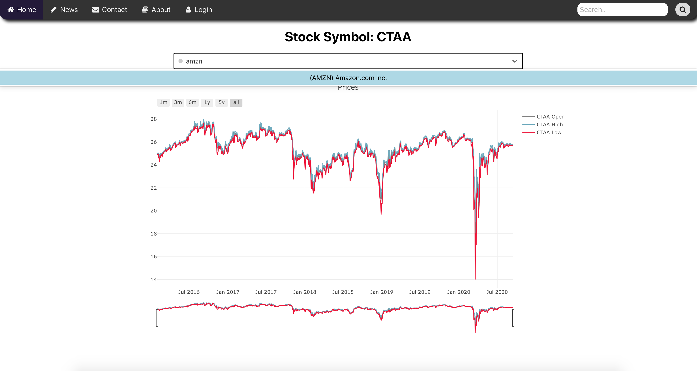

## Welcome To StocksApp 

Stocks app is a simple reactJS web application which gives users the ability to query for historical data on stocks. The page consists of a search tool, plot section and, relevant news section. 

From here, users are given relevant news info based upon their search query which is layed out in a card format.

## Additional Info

This project was bootstrapped with [Create React App](https://github.com/facebook/create-react-app).

## Available Scripts

In the project directory, you can run:

### `npm start`

Runs the app in the development mode. 
Open [http://localhost:3000](http://localhost:3000) to view it in the browser.

The page will reload if you make edits. 
You will also see any lint errors in the console.

### `npm test`

Launches the test runner in the interactive watch mode. 
See the section about [running tests](https://facebook.github.io/create-react-app/docs/running-tests) for more information.

### `npm run build`

Builds the app for production to the `build` folder. 
It correctly bundles React in production mode and optimizes the build for the best performance.

The build is minified and the filenames include the hashes. 
Your app is ready to be deployed!

### Dependencies
### 'npm install react-scripts'
